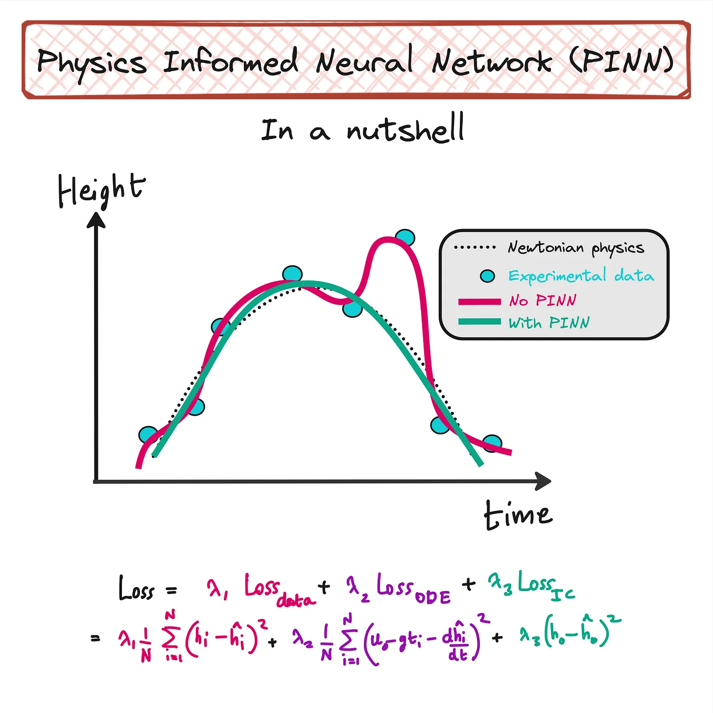
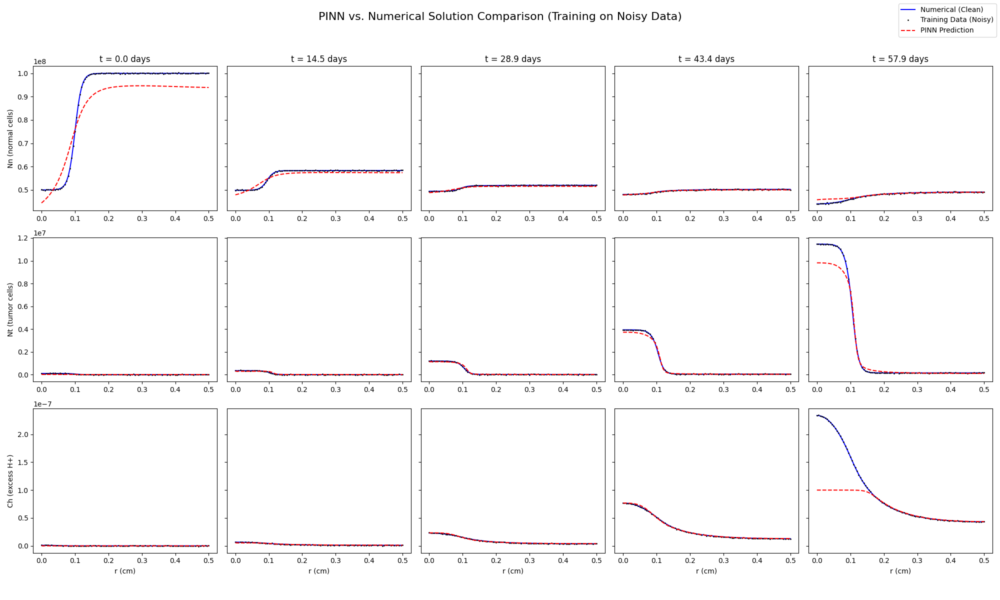

# PINN for Acid-Mediated Tumor Growth 🧠

This repository has a TensorFlow implementation of a **Physics-Informed Neural Network** (**PINN**) to solve a system of nonlinear **partial differential equations** (**PDEs**) that model acid-mediated tumor growth. This project shows how **PINNs** can solve complex biological models, even with sparse and noisy data, by embedding the governing physical laws right into the neural network's training.


_Conceptual illustration: A standard neural network (magenta) might overfit sparse or noisy data. In contrast, a **PINN** (teal) is constrained by the underlying physics (dotted line), leading to a more accurate and physically plausible solution._

---

## Overview

**PINNs** are a modern, data-driven alternative to traditional PDE solvers. They're neural networks trained to satisfy not only observed data but also the governing differential equations themselves.

This project tackles the acid-mediated tumor growth (ATG) model, which is a set of coupled **PDEs** describing the interaction between normal cells, tumor cells, and the acidic environment they create.

The key parts of our approach are:

- **Data Loss**: Measures the difference between the **PINN's** predictions and the observed training data.
- **Physics Loss**: Pushes the model to obey the ATG partial differential equations.
- **Boundary/Initial Condition Loss**: Makes sure the solution respects the problem's physical and time-based constraints.

---

## The Physical Model: Acid-Mediated Tumor Growth

The model is based on the work of Gatenby and Gawlinski and describes the dynamics of normal cells ($N_n$), tumor cells ($N_t$), and excess H+ ion concentration ($C_h$) in a spherical geometry.

### Governing Equations

The system is described by the following set of **PDEs**:

Normal Cells ($N_n$):
$$ \boxed{\frac{\partial N*{n}}{\partial t} = r*{n1}N*{n}\left(1-\frac{N*{n}}{K*{n}}\right) - r*{n2}C*{h}N*{n}} $$
 This equation models the logistic growth of normal cells, which is negatively impacted by the concentration of excess H⁺ ions ($C_h$).

Tumor Cells ($N_t$):
$$ \boxed{\frac{\partial N*{t}}{\partial t} = r*{t1}N*{t}\left(1-\frac{N*{t}}{K*{t}}\right) + \frac{1}{r^{2}}\frac{\partial}{\partial r}\left[r^{2}D(N*{n})\frac{\partial N*{t}}{\partial r}\right]} $$
The tumor cell diffusivity $D(N*{n})$ depends on the normal cell density:
$$ \boxed{D(N*{n}) = D*{t}\left(1-\frac{N*{n}}{K*{n}}\right)} $$
This equation describes the logistic growth and diffusion of tumor cells. The diffusion is nonlinear because it slows down in areas with more normal cells.

Excess H⁺ Concentration ($C_h$):
$$ \boxed{\frac{\partial C*{h}}{\partial t} = r*{h1}N*{t} - n*{h2}C*{h} + D*{h}\frac{1}{r^{2}}\frac{\partial}{\partial r}\left(r^{2}\frac{\partial C\_{h}}{\partial r}\right)} $$
This equation models the production of H⁺ ions by tumor cells, its natural clearance, and its diffusion through the tissue.

## PINN Implementation ⚙️

We built a **PINN** to solve this system, combining data-driven learning with the physics-based equations above.

### 1. Network Architecture

- **Network**: A Multi-Layer Perceptron (MLP) with 3 hidden layers and 80 neurons per layer.
- **Activation Functions**: `tanh` for hidden layers and a `sigmoid` output to keep concentrations positive.
- **Input/Output Scaling**: Time and space inputs are normalized. The network's outputs are scaled back to their proper physical units for loss calculation.

### 2. Loss Function

The total loss is a weighted sum of four parts:

- **Data Loss**: The Mean Squared Error (MSE) between the **PINN's** predictions and the noisy training data.
- **Physics Loss**: The residuals of the three governing **PDEs**, checked at random points in the domain.
- **Boundary Condition Loss**: Enforces the Neumann (zero-gradient) conditions at the tumor center ($r=0$) and outer boundary ($r=0.5$ cm).
- **Initial Condition Loss**: Ensures the model's prediction at $t=0$ matches the starting state.

### 3. Training Strategy

- **Optimizer**: Adam optimizer with a learning rate of $1 \times 10^{-3}$.
- **Epochs**: The model is trained for 10,000 epochs.
- **Loss Weighting**: We use weights to balance the loss terms (`500` for data, `50` for IC/BC, and `1` for PDE loss).
- **Automatic Differentiation**: Gradients are computed exactly using TensorFlow's `tf.GradientTape`.

---

## How to Run the Code 🚀

The Python script is self-contained. It first generates a "ground truth" dataset using a traditional numerical solver, adds noise to simulate experimental data, and then trains the **PINN** on this noisy data.

### Prerequisites

You'll need Python 3 and these libraries:

```

numpy
scipy
matplotlib
tensorflow

```

You can install them using pip:

```bash
pip install numpy scipy matplotlib tensorflow
```

### Execution

To run the entire pipeline, just run the script from your terminal:

```bash
python main.py
```

### Expected Output

The script will:

1.  Print the progress of the numerical solver.
2.  Save the noisy training data to `tumor_growth_data.csv`.
3.  Print the **PINN** training progress every 200 epochs.
4.  Print the final L2 errors for each variable.
5.  Show and save a plot named `pinn_comparison.png` comparing the results.

---

## Results 📊



The final plot shows the **PINN's** ability to learn the system's dynamics, filter noise from the training data, and provide a solution that's close to the true numerical solution.

_Example output plot comparing the PINN prediction (red dashed line) against the clean numerical solution (blue solid line) and the noisy data points (black dots) used for training._

---

## References

For more on **Physics-Informed Neural Networks**, check out the original authors' work:

- **Main PINN Website:** [https://maziarraissi.github.io/PINNs/](https://maziarraissi.github.io/PINNs/)
- Raissi, Maziar, Paris Perdikaris, and George E. Karniadakis. "[Physics-informed neural networks: A deep learning framework for solving forward and inverse problems involving nonlinear partial differential equations](https://www.sciencedirect.com/science/article/pii/S0021999118307125)." _Journal of Computational Physics_ 378 (2019): 686-707.
- Raissi, Maziar, Paris Perdikaris, and George Em Karniadakis. "[Physics Informed Deep Learning (Part I): Data-driven Solutions of Nonlinear Partial Differential Equations](https://arxiv.org/abs/1711.10561)." _arXiv preprint arXiv:1711.10561_ (2017).
- Raissi, Maziar, Paris Perdikaris, and George Em Karniadakis. "[Physics Informed Deep Learning (Part II): Data-driven Discovery of Nonlinear Partial Differential Equations](https://arxiv.org/abs/1711.10566)." _arXiv preprint arXiv:1711.10566_ (2017).
